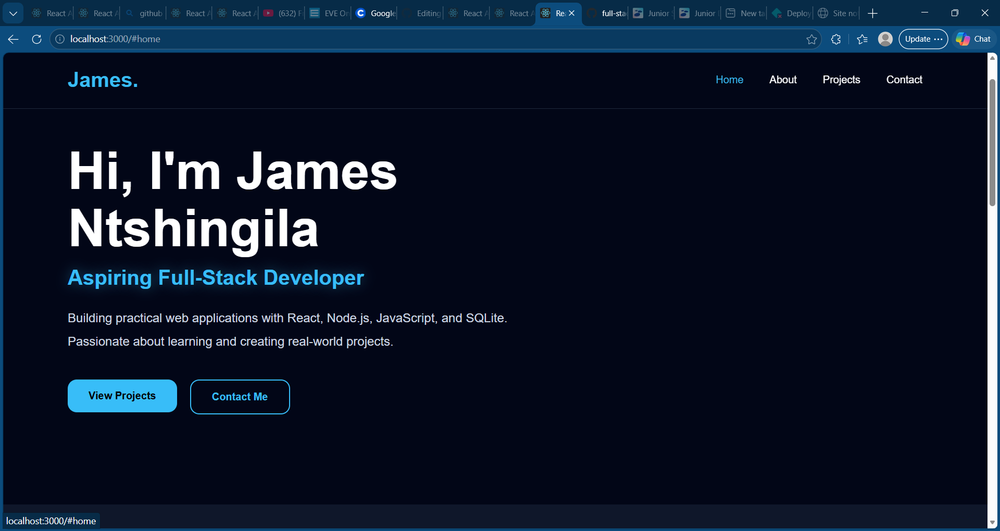
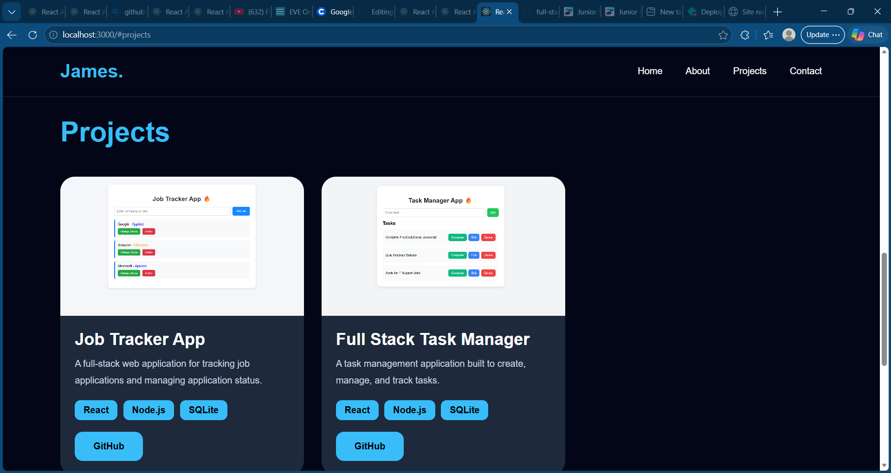

# 🌐 James Ntshingila Portfolio Website

A modern and professional portfolio website built to showcase my projects, skills, and journey as an aspiring **Full-Stack Developer**.

This portfolio highlights my development work, technical skills, and passion for building real-world applications.

---

## 🚀 Features

✅ Modern responsive design  
✅ Smooth scrolling navigation  
✅ Professional UI/UX  
✅ Project showcase section  
✅ Contact information section  
✅ GitHub project links  
✅ Mobile-friendly layout  

---

## 🛠️ Tech Stack

### Frontend
- React.js
- CSS3
- JavaScript

### Tools
- Git
- GitHub
- VS Code

---

## 📸 Screenshots

### 🏠 Homepage



---

### 💻 Projects Section



---

## 📂 Featured Projects

### 🚀 Job Tracker App
A full-stack web application for tracking job applications and managing application progress.

**Tech Used:**
- React
- Node.js
- SQLite

GitHub Repo:  
`github.com/Jj879304/job-tracker-app`

---

### ✅ Full Stack Task Manager
A task management web application built to create, update, manage, and track tasks.

**Tech Used:**
- React
- Node.js
- SQLite

GitHub Repo:  
`github.com/Jj879304/full-stack-task-manager`

---

## ⚙️ Installation & Setup

### Clone Repository

```bash
git clone https://github.com/Jj879304/portfolio-website.git
